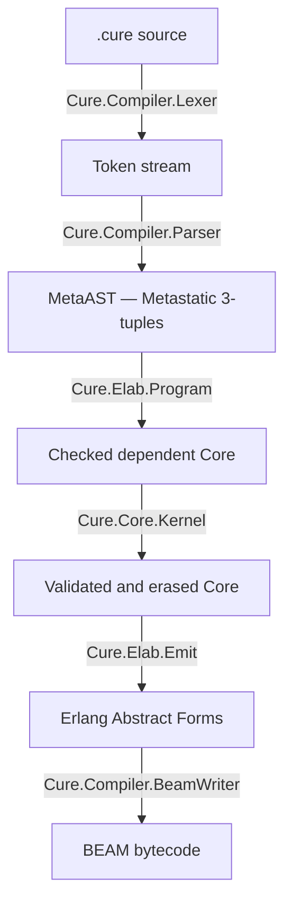

# Cure

Dependently-typed programming language for the BEAM virtual machine with
one kernel-checked compiler pipeline and first-class OTP concurrency.

Cure compiles `.cure` source files to BEAM bytecode, enabling programs to run
natively on the Erlang VM alongside Erlang and Elixir code.

## Architecture



Every pipeline stage emits structured events via `Cure.Pipeline.Events`,
backed by an Elixir `Registry` in PubSub mode. External tools (LSP, profilers,
IDE plugins) can subscribe to observe and react to compilation in real time.

## Internal Representation

Cure uses [Metastatic](https://hexdocs.pm/metastatic)'s MetaAST 3-tuple
format as its internal AST:

```elixir
{type_atom, keyword_meta, children_or_value}
```

This provides a well-defined, layered AST structure and interoperability with
Metastatic's cross-language analysis tools.

## Key Features

- **Dependent types** -- types that depend on values, verified at compile time
- **Indexed and dependent types** -- GADT-style indexed families, dependent
  function results, implicit arguments, Sigma pairs, and kernel-checked
  propositional equality
- **Records** -- named product types with construction (`Point{x: 1, y: 2}`),
  field access (`p.x`), and functional update (`Point{p | x: new_x}`);
  compile to BEAM maps; type-checked with per-field schemas
- **Typed FSM macros** -- finite state machines as transparent standard-library
  syntax with
  compile-time verification (reachability, deadlock freedom, hard event validation),
  dual-mode compilation (simple `gen_statem` or callback `GenServer`),
  Finitomata-inspired `!`/`?` event suffixes, inline `on_transition` handlers,
  and lifecycle callbacks (`on_enter`, `on_exit`, `on_failure`, `on_timer`)
- **Typed actors and supervisors** (v0.25.0, dependent macro surface in
  v0.34) -- `actor Name` and `sup Name` expand to checked lifted modules over
  `Std.Otp`, with compile-time checks on
  strategy / intensity / period / child-id uniqueness / restart /
  shutdown. `Std.Actor`, `Std.Process`, and `Std.Supervisor` expose the
  runtime from Cure source
- **Applications and releases** (v0.26.0) -- an `app Name` container
  declares the project's OTP `Application` callback in Cure source with
  `vsn`, `description`, `root`, `applications`, `env`, `on_start`,
  `on_stop`, and `on_phase :name` clauses. The compiler rejects
  projects with more than one `app` container and cross-checks its
  name and start phases against `[application]` in `Cure.toml`. The
  `cure release` subcommand (also `mix cure.release`) packages the
  compiler output as a bootable BEAM release under
  `_build/cure/rel/<name>/`. `Std.App` exposes `ensure_all_started`,
  `stop`, `env`, `env_int`, `env_atom`, `env_bool`, and `env_string`
  from Cure source
- **Melquiades Operator** (v0.25.0) -- `pid <-| message` (Unicode alias
  `pid ✉ message`) is library-defined sugar for `Std.Otp.tell`; it checks the
  message against the indexed process handle and returns `Effect(Unit)`
- **Indentation-structured** -- no closing delimiters, visual layout determines scope
- **Expression-oriented** -- everything is an expression, the last expression in a block is its value
- **BEAM-native** -- compiles to standard BEAM bytecode, full OTP interoperability
- **Interfaces and implementations** -- ad-hoc polymorphism via
  `interface`/`implementation`, explicit `requires` constraints, canonical
  cross-module instance lookup, and structural derivation
- **Quantitative types** -- erased, linear, affine, and unrestricted binders
  are checked by the dependent kernel before erasure
- **Effects** -- `Effect(T)` marks direct-style computations while keeping the
  effect former visible to dependent checking

## Quick Example

```cure
mod MyApp.Math
  use Std.Result
  use Std.Option

  type Sign = Positive | Negative | Zero

  fn double(n: Int) -> Int = n + n

  fn classify(x: Int) -> Sign =
    match x
      x when x > 0 -> Positive
      x when x < 0 -> Negative
      _ -> Zero

  fn safe_divide(a: Int, b: Int) -> Result(Int, Atom) =
    pickup
      b == 0 -> Error(:division_by_zero)
      else   -> Ok(a / b)
```

## Usage

```bash
# Compile a Cure source file to BEAM bytecode
mix cure.compile path/to/file.cure

# Compile all .cure files in a directory
mix cure.compile path/to/dir/ --output-dir _build/cure/project/ebin
```

## Interactive REPL (v0.24.0)

`cure repl` drops you into a readline-grade loop backed by a raw-mode
line editor with live Cure syntax highlighting (via `makeup_cure` +
`marcli`), persistent history, incremental reverse search, Tab
completion, and a minimal vi mode:

```text
cure(1)> fn add_ints(a: Int, b: Int) -> Int = a + b
defined add/2
cure(2)> :t add_ints(1, 2)
add_ints(1, 2) : Int
cure(3)> :bench Std.List.map([1, 2], fn (x) -> x + 1) 10000
n=10000  min=1 us  avg=2 us  p95=3 us  max=42 us
```

Key bindings (emacs mode): `Left`/`Right` cursor, `Up`/`Down` for
history, `Ctrl+A`/`Ctrl+E` begin/end of line, `Ctrl+W` kill word,
`Ctrl+K`/`Ctrl+U` kill to end/start, `Ctrl+R` incremental history
search, `Tab` completion for meta-commands, file paths, loaded
modules and Cure keywords, `Ctrl+L` clear screen, `Ctrl+C` abort
line, `Ctrl+D` EOF. A minimal vi mode is available via `:mode vi`.
Meta-commands include `:t`, `:effects`, `:load`, `:reload`, `:use`,
`:fmt`, `:holes`, `:env`, `:reset`, `:history`, `:search`, `:save`,
`:edit`, `:time`, `:bench`, `:ast`, `:theme`, `:mode`, `:color`,
`:clear`, `:help`, `:quit`. See [`docs/REPL.md`](docs/REPL.md).

From Elixir code:

```elixir
# Compile and load into the running VM
{:ok, module} = Cure.Compiler.compile_and_load(source)
module.my_function(args)

# Compile to disk
{:ok, module, warnings} = Cure.Compiler.compile_file("hello.cure")
```

## Modules

- `Cure` -- root module, version
- `Cure.Pipeline.Events` -- PubSub event system (Registry-backed); every
  pipeline stage emits structured events that external tools can subscribe to
- `Cure.Compiler` -- orchestrator: source -> lex -> parse -> elaborate ->
  validate/erase -> emit -> .beam
- `Cure.Compiler.Token` -- token struct (`type`, `value`, `line`, `col`)
- `Cure.Compiler.Lexer` -- tokenizer for the full Cure syntax (keywords,
  operators, literals, indentation, string interpolation, FSM transitions)
- `Cure.Compiler.Parser` -- Pratt (precedence-climbing) parser producing
  MetaAST 3-tuples; indentation-aware, handles all expression and structural
  forms (functions, modules, records, types, protocols, implementations,
  imports, FSMs)
- `Cure.Compiler.Parser.Precedence` -- operator binding power table
- `Cure.Compiler.ModuleIndex` and `Cure.Compiler.ModuleInterface` -- canonical
  module identities, dependency ownership, and immutable checked exports used
  by both authored and macro-generated references
- `Cure.Elab.Program` -- module-level dependent elaboration, declaration
  grouping, import/interface loading, totality checks, and canonical definition
  identity
- `Cure.Elab.Elaborator` -- bidirectional elaboration from surface MetaAST into
  dependent `Cure.Core` terms
- `Cure.Core.Kernel` -- trusted validation boundary for the dependent Core
- `Cure.Elab.Erase` and `Cure.Elab.Emit` -- erase proof/index arguments and
  lower the remaining Core program to Erlang abstract forms
- `Cure.Compiler.BeamWriter` -- compiles Erlang abstract forms to BEAM
  bytecode via `:compile.forms/2` and writes `.beam` files
- `Cure.App.Resource` -- emits the OTP `<name>.app` resource file
  into the output directory; threads metadata from the container
  and `[application]` (`vsn`, `applications`, `included_applications`,
  `registered`, `env`, `start_phases`)
- `Cure.Release` -- builds a bootable BEAM release under
  `_build/cure/rel/<name>/`: `.rel`/`start.boot`/`start.script`
  assembly via `:systools`, `sys.config` / `vm.args` copying, and
  the POSIX `bin/<name>` runner script (emits `:release` events,
  surfaces `E052` / `E055`)
- `Cure.Diagnostic.Registry`, `Cure.Diagnostic.Adapter`, and
  `Cure.Diagnostic.Sink` -- stable diagnostic ownership, conversion, and shared
  terminal/JSON/editor presentation
- `Cure.SMT.Process` -- Z3 solver process management via Erlang port;
  interactive query execution with timeout and sentinel-based response parsing
- `Mix.Tasks.Cure.Compile` -- `mix cure.compile` task with formatted error output
- `Mix.Tasks.Cure.CompileStdlib` -- `mix cure.compile_stdlib` compiles the standard library
- `Mix.Tasks.Cure.Release` -- `mix cure.release` builds a bootable BEAM
  release for the project's `app` container (v0.26.0)

## Standard Library

The standard library is self-hosted -- written in Cure itself under `lib/std/`.
Compile it with `mix cure.compile_stdlib`.

- **`Std.Core`** -- identity, composition, application, and other foundational
  combinators. `Option` and `Result` now live in their canonical
  `Std.Option` and `Std.Result` modules
- **`Std.List`** (29 functions) -- length, is_empty, head, tail, last, cons,
  append, concat, reverse, map, filter, foldl, foldr, flat_map, zip_with, nth,
  at, set_at, take, drop, contains, find, any, all, uncons, split_first, sum,
  product, count
- **`Std.Math`** (18 functions) -- abs, sqrt, pow, log, log2, log10, ceil,
  floor, round, pi, max, min, clamp, sign, negate, is_even, is_odd, safe_div
- **`Std.String`** (34 functions) -- characters, from_characters, length,
  is_empty, concat, downcase, upcase, lowercased, uppercased,
  lowercased_character, uppercased_character, has_prefix, has_suffix,
  contains, first, last, prefix, suffix, drop_first, drop_last, trim,
  trim_leading, trim_trailing, split, split_on, from_int, from_float,
  from_atom, to_int, to_float, to_existing_atom, unsafe_to_atom, repeat,
  reverse (`to_atom` was split into `to_existing_atom` and `unsafe_to_atom`)
- **`Std.Tuple`** -- canonical flat tuple types and projections:
  `first`, `second`, `swap`, and n-ary accessors such as `third`
- **`Std.Optic`** -- statically typed lenses, affine traversals, and
  composable record-field optics; replaces the retired `Std.Access`
- **`Std.Show`** -- `Show` interface with `show/1` dispatch for
  Int, Float, String, Bool, Atom; `show_line/1` convenience
- **`Std.Equatable` / `Std.Comparable`** -- comparison interfaces backing
  `==`, `!=`, `<`, `<=`, `>`, `>=`, and `compare`
- **`Std.Equivalent`** -- the inductive identity type and its
  kernel-checked `reflexive`, `sym`, `trans`, and `cong` proofs
- **`Std.Io`** (8 functions) -- put_chars, println, print, int_to_string,
  float_to_string, atom_to_string, print_int, print_float
- **`Std.System`** (8 functions) -- monotonic_time, system_time, timestamp_ms,
  timestamp_us, node, otp_version, cpu_count, exit
- **`Std.Actor`** (v0.25.0; rebuilt as a source macro in 0.34) --
  defines the `actor` and `behavior` macros, which expand a
  declarative state/message/query spec into a checked `GenServer`
  lifted module. The generated actor module itself, not `Std.Actor`,
  exposes `start`, `start_link`, `send`, `request`, and `stop`
- **`Std.Process`** (6 functions) -- self, monitor, demonitor, link,
  unlink, is_alive. A compatibility facade over `Std.Otp`'s indexed
  process handles and effects; new code should call `Std.Otp` directly
- **`Std.Supervisor`** (v0.25.0; rebuilt as a source macro in 0.34) --
  defines the `sup` macro plus the restart/shutdown/strategy
  vocabulary (`permanent`, `transient`, `temporary`, `brutal_shutdown`,
  `shutdown_after`, `one_for_one`, `one_for_all`, `rest_for_one`, ...)
  and child-spec builders it expands into
- **`Std.App`** (7 functions) -- ensure_all_started, stop, env,
  env_int, env_atom, env_bool, env_string. Effect-typed wrappers over
  `:application`, alongside the `app` macro described on the
  [Applications](/applications) page

## Examples

See the `examples/` directory for sample Cure programs:

- `hello.cure` -- minimal module with a greeting function
- `math.cure` -- arithmetic, multi-clause factorial, conditionals
- `traffic_light.cure` -- FSM definition with wildcard transitions
- `list_basics.cure` -- list operations (map, filter, fold)
- `result_handling.cure` -- Result type error handling with and_then
- `pattern_guards.cure` -- pattern matching, guards, match expressions
- `recursion.cure` -- recursive functions (factorial, fibonacci, reverse)
- `protocols.cure` -- interface definition, implementation, constraints, and
  dispatch
- `ffi.cure` -- calling Erlang functions via @extern
- `adt.cure` -- algebraic data types (Option, Result, Color)
- `records.cure` -- record definition, construction, field access, and
  functional update with `TypeName{base | field: val}` syntax
- `cure_turnstile/` -- full example project: callback-mode FSM with
  `on_transition` handler, GenServer wrapper, and tests
- `cure_spline/` -- full example project: natural cubic spline
  interpolation library in Cure (Thomas algorithm, per-segment cubic
  coefficients, evaluation/derivative/sampling), with an Elixir wrapper,
  a demo that renders an ASCII plot of a fitted sine, and a 25-case
  test suite
- `cure_moneta/` -- full example project: money and ledger library;
  multi-line ADT (`Currency`), domain aliases (`PositiveAmount`, `Rate`),
  `Money{amount, currency, fractional_units}` record (EUR/JPY/OMR-aware
  display), `Show` and `Equatable` interfaces, FX conversion via `@extern` FFI,
  ledger mutations with `Result`-chaining, and a payment transaction FSM
  with hard (`dispatch!`), soft (`retry?`, `cancel?`), wildcard, `on_timer`,
  `on_enter`, and `on_failure` callbacks
- `cure_colony/` -- v0.25.0 supervision-tree demo: a worker actor,
  an echo actor, and a `sup Colony` supervisor wiring them under a
  `:one_for_one` strategy with per-child `restart` and `shutdown`
  overrides. Exercises `actor`, `sup`, and the Melquiades Operator
  end to end
- `cure_forge/` -- v0.26.0 fully-fledged application demo: a metrics
  actor, a logger actor, a queue actor, and a pool actor, wired under
  a `sup Forge.Root` tree that is itself the `root` of an
  `app CureForge` container. Exercises `app` (with `vsn`,
  `description`, `env`, `applications`, `on_start`, `on_stop`, and
  `on_phase :warm_cache`), end-to-end message passing between actors
  through the Melquiades Operator `<-|`, `Std.App` environment reads,
  and `cure release` packaging
- `cure_motif/` -- length-indexed step sequencer showcase: refinement
  types for every MIDI-domain primitive, `Std.Vector`-backed
  `Pattern(n)` helpers with observable length claims, an
  `@record`-annotated callback-mode `Envelope` FSM, `Cure.Temporal`
  liveness proofs over the FSM graph, a three-actor supervision tree
  (`Clock`, `Sequencer`, `Voice`), a Melquiades-relay sequencer, an
  `app CureMotif` container, and an Elixir-side ASCII piano-roll
  renderer driven by `CureMotif.Demo.run/0`

Compile and run:

```bash
cure compile examples/hello.cure
cure run examples/recursion.cure
cure check examples/protocols.cure
```

## Documentation

- [Language Specification](docs/LANGUAGE_SPEC.md) -- syntax, keywords, operators, all constructs
- [Macros](docs/MACROS.md) -- `macro` containers, syntax rules and holes, `becomes` / `computed by` / `syntax family`, `Std.Syntax`, and self-proving `example` / `explain` (v0.34.0)
- [Type System](docs/TYPE_SYSTEM.md) -- dependent bidirectional checking,
  indexed families, quantitative binders, conversion, and erasure
- [Dependent Types](docs/DEPENDENT_TYPES.md) -- indexed-family and proof
  programming guide
- [Patterns](docs/PATTERNS.md) -- structural patterns, guards, pins, and
  pattern-valued `let`
- [FFI](docs/FFI.md) -- `@extern` foreign-function interface: module forms, effects, and lowering
- [FSM Guide](docs/FSM_GUIDE.md) -- FSM definition, compilation, runtime, verification
- [Supervision](docs/SUPERVISION.md) -- typed actors, `sup` containers, the Melquiades Operator, links and monitors (v0.25.0)
- [Applications](docs/APP.md) -- `app` containers, `Cure.toml` `[application]` / `[release]` sections, the `cure release` subcommand, and `Std.App` (v0.26.0)
- [Documentation Tooling](docs/DOC.md) -- `cure doc` pipeline, `[doc]` config, placeholder interpolation, Makeup highlighting, REPL Markdown renderer (v0.29.0)
- [John](docs/JOHN.md) -- `mix cure.john`, `cure john`, and the `:john` REPL meta-command; collector / renderer / Marcli fallback reference (v0.30.0)
- [Standard Library](docs/STDLIB.md) -- API reference for the stdlib modules (every module now ships a `## Examples` block)

## Building

```bash
mix deps.get
mix compile
mix test
```

## Quality

```bash
mix format
mix credo --strict
mix dialyzer
```

## Status

The classic checker/code-generator has been removed. Every source file now
passes through the dependent elaborator, trusted Core validator, erasure, and
BEAM emitter. The current unreleased work includes indexed families,
quantitative binders, interfaces and implementations, structural derivation,
canonical module interfaces, macro expansion, structured diagnostics, and
authoritative compilation/runtime checks for the root example corpus. See
[`ROADMAP-0.34.md`](ROADMAP-0.34.md) and the Unreleased section of
[`CHANGELOG.md`](CHANGELOG.md).
### Release history
- **v0.32.0 -- Trust, Export, Recall, Narrate**: proof-carrying packages
  (`mix cure.verify`), cross-language ADT export to proto3
  (`mix cure.export_types`), REPL session snapshots (`cure snap`), and a
  narrative architecture generator (`cure story`). Error codes `E065`-`E070`.
- **v0.30.2 / v0.30.1**: `john` polish -- UTF-8 fixes for `mix cure.john`,
  structured `erl_crash.dump` summaries, ASCII-only banners, dialyzer cleanups.
- **v0.30.0 -- John**: a single panoramic diagnostic exposed via
  `mix cure.john`, `cure john`, and the `:john` REPL meta-command; reports
  Cure / BEAM / system / project / runtime state as Markdown-to-ANSI.
- **v0.29.0 -- Make Documentation Great**: `cure doc` produces an ExDoc-like
  two-pane site driven by `[doc]` in `Cure.toml`; stdlib gains `## Examples`
  blocks; website ships `/stdlib`; REPL gets a block-aware Markdown renderer;
  Vim and VS Code plugins re-aligned with the current grammar.
- **v0.28.0 -- Talk Back**: parser error recovery (`E063`), "did you mean?"
  suggestions, `cure fmt --dry-run`, `cure bless` Socratic type-error
  assistant, `@record` + `cure replay` FSM time-travel, Playground with live
  type-checking and sandboxed evaluator. Patches v0.28.1 / v0.28.2 promoted
  REPL top-level declarations (`Cure.REPL.Session`) into the checker env.
- **v0.27.0 -- See Your System Breathe**: observability and verification:
  `Cure.OTel`, `cure top`, `cure trace`, `Cure.Temporal` (LTL bounded model
  checker), `Cure.Protocol` (session-typed binary protocols),
  typed-hole suggestions; new stdlib modules `Std.Time`,
  `Std.Regex`, `Std.CRDT`; OSC 8 clickable error paths; LiveView Playground.
- **v0.26.0 -- Applications and Releases**: `app` container, `[application]`
  / `[release]` sections in `Cure.toml`, `cure release` packaging, `Std.App`.
  Error codes `E051`-`E055`.
- **v0.25.0 -- Typed Supervision Trees**: Melquiades Operator `<-|` (alias
  `✉`), typed `actor` and `sup` containers compiling to `GenServer` /
  `Supervisor` modules, `Std.Actor` / `Std.Process` / `Std.Supervisor`.
- **v0.24.0 -- The REPL You Deserve**: raw-mode line editor with live
  Makeup-powered syntax highlighting, persistent history, `Ctrl+R`
  incremental search, Tab completion, minimal vi mode, Marcli-rendered
  `:help`.
- **v0.23.0 -- Packaging, Proof, and Polish**: remote package registry
  (`Cure.Project.Registry`), Ed25519 signing, transparency log,
  `cure publish`, `cure doctor`, `cure fix`, `cure test --cover`, `Std.Json`,
  `Std.Http`, property shrinking. Error codes `E038`-`E042`.
- **v0.22.0 -- Loose Ends**: multi-statement lambda bodies (brace and `end`
  forms), binary comprehension generators, `byte_size` refinements on
  trailing binary segments, first-class FSM state struct.
- **v0.21.0 -- Through the Segments**: Erlang-style binary destructuring
  with exhaustiveness (`E031`), multi-line `type` ADTs, ADT function-arrow
  payloads, deep `let` destructuring, `@derive(Functor, Monoid, JSON)`,
  algebra formatter as default, `Std.Access`.
- **v0.20.0 -- The Shape of Things**: plain `#` comments as AST nodes, full
  bitstring segment grammar (`<<x::utf8, rest::binary>>`),
  `Inspect.Algebra`-style pretty printer, structural pattern refinement
  narrowing.
- **v0.19.0 -- Bring the Furniture**: `proof` containers, `assert_type`,
  record field defaults, `@derive(Show, Eq, Ord)`, property-based testing,
  lazy iterator protocol, package-version resolver, mutual-recursion
  totality, multi-head cons patterns.
- **v0.18.0 -- Deep Destructuring**: nested patterns across tuples, lists,
  maps, records, and ADT constructors; pin operator `^x`; repeated-variable
  equality guards; record field punning; nested-exhaustiveness analyser.
- **v0.17.0 -- Proofs & Polish: Toward Idris**: dependent pairs / Pi types /
  propositional equality, type-level normaliser, unification with implicit
  args, typed holes, totality checker, path-sensitive refinement, REPL,
  `cure watch`, LSP inlay hints / rename / semantic tokens, `cure new`,
  `Cure.lock`, `cure bench`, doctests, MIT license, VS Code extension
  scaffold.
- **v0.16.0 -- Finitomata-Inspired FSM Rewrite**: dual-mode FSM compilation,
  hard (`event!`) / soft (`event?`) suffixes, lifecycle callbacks
  (`on_enter`, `on_exit`, `on_failure`, `on_timer`), introspection API.
- **v0.15.0 -- Developer Experience**: public `Cure.quote` / printer API,
  effect system, HTML doc generator, formatter, first REPL, `Std.Test`.
- **v0.14.0 -- Real-World Readiness**: `Cure.toml` package management (path
  deps), cross-module protocol registry, `cure test` with `Std.Test`.
- **v0.13.0 -- Depth Over Breadth**: dependent-type verification at call
  sites, type-level arithmetic in return types, LSP code actions /
  definition / incremental compile, experimental AST optimizer,
  `Std.Map` / `Std.Set` / `Std.Option` / `Std.Functor`.
- **v0.12.0 -- The Complete Rewrite**: rewrite from Erlang to Elixir,
  import resolution, dependent-type representation, typeclass derive, LSP
  symbols, Z3 model parser, FSM type-safety analysis, Levenshtein-based
  suggestions.
- **v0.11.0 -- First Roadmap Complete**: nine self-hosted stdlib modules,
  protocol/typeclass system, Z3 SMT integration with refinement types,
  guard refinement, type-directed optimizer, pattern-exhaustiveness
  checker, FSM runtime, LSP, CLI escript, MCP server.
- **v0.10.0 -- Project Bootstrap**: initial Elixir project, lexer with
  indentation tracking, Pratt parser, BEAM codegen, type-system foundation,
  FSM `gen_statem` compiler, CLI, CI, examples.
## License

MIT. See the repository's
[LICENSE](https://github.com/cure-lang/cure-lang/blob/main/LICENSE).
